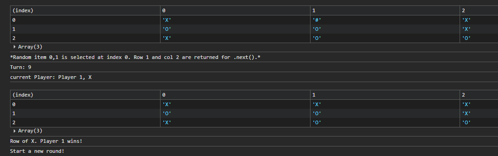
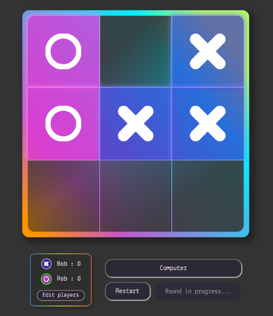

# Tic-tac-toe

A classic game of Tic-tac-toe, created in vanilla JavaScript. The goal of this project was to explicitly use objects and factories, thereby minimizing global code and separating state logic from the UI.

Created as part of the JavaScript course of The Odin Project curriculum.

## Description

To meet the specifications of the project goals, the game was first created to run exclusively in the console.

### The console

Objects for players functions, board functions, and game functions were established. Game() captures the current Board() in a variable. A player move might look like this:

1. currentGame().next(1,1) is typed into the console.
2. The given coordinates (1,1) are translated into an index-friendly format(i.e. (board[0])[0]) and currentBoard() checks that the move is valid. If it is, the icon of currentPlayer replaces the "#" marker.
3. The updated board is displayed to the console.
4. checkWin() is used to verify if a winning or tie combination is present. If there is, a winStatus is returned and the player score is adjusted accordingly.

### The completed game and other features

The IIFE Play() serves as the "main" function of the game, connecting the Game() functions to the DOM. All event listeners are located here, as well as functions to restart the game or round and edit player names. Toggling behavior for elements are consequently here. This includes an edit/submit mode for editing player names, a confirmation mode for restarting the game, and a game-in-progress state to prevent starting a new round.
This proved to be the most complicated part of designing the game, as the DOM can "communicate" very differently from the different game objects. Passing certain information throughout objects, such as the correct message for errors or wins, and discovering side-effects was particularly challenging.

#### Playing against the computer
autoNext() and autoRound() functions were created to automatically play the game. autoNext() uses functions to identify eligible [row, col] pairs and make a random selection. autoRound() will run autoNext() while the game has not met a win or tie condition. autoRound() was specifically used for testing and is not currently present on the UI.
Note: The random selection is simply based on a generated number. Filtering the array of [row, col] pairs that getRandomChoice() uses is a potential way to narrow its choices to cells that are closer to a winning condition.

#### Experimenting with CSS
As with the other similar curriculum projects completed, additional techniques were explored:

- X and O icons are centered background images for ::before pseudo-elements. This lets them scale nicely without adding img or svg elements directly.
- Very simple animations are used throughout. Just for fun.
- Gradient in border (adapted from [CodyHouse](https://codyhouse.co/nuggets/css-gradient-borders)): stacking two linear-gradients in conjunction with padding-box, border-box, and a transparent border to make the second gradient appear as a border

## Future considerations

There are undoubtedly many ways to simplify the object roles and interactions. Some notable cases:

- The use of a coordinate system for the board (board[2] would be the entire third row of the board, and the column would be determined by the index of that array) helped in identifying specific cell locations for win conditions or remaining spaces. However, it complicated interactions with the DOM, as the cells retrieved from the UI were a NodeList. Recognizing this discrepancy early could have assisted in either planning accordingly or using a different method entirely (like a [magic square](https://en.wikipedia.org/wiki/Magic_square)).
- Similarly, the conversions between human-friendly coordinates like .next(1,1) to an array[index] form of (board[0])[0] led to complications in creating functions. Using index values in .next() would likely have been sufficient for this project, unless a user is expected to manually give coordinates.
- The distinction between Board() and Game() became muddled. There is some redundancy between the two, and better communication between their functions would simplify the way the game is run.
- Play() also very quickly became a "mega function", holding all event listener functions, certain checks, and the autoRound() function. It could have potentially been minimized or allocated differently.

In sum, the specific challenges of this project put into practice new methods related to encapsulation and closures. A deeper understanding of how objects communicate with each other and with the DOM will be strongly beneficial in future projects.